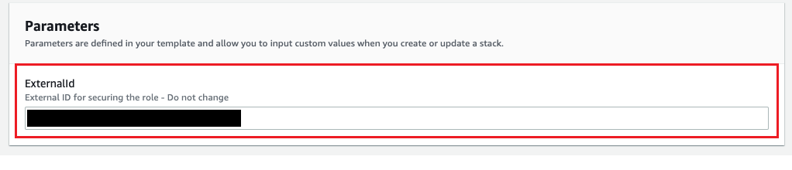

# Epsagon Terraform AWS Integration

Setup Epsagon <-> AWS integration module

This module provides the ability to setup Epsagon integration via Terraform. This module will setup the following:

- Cross account IAM role for Epsagon

## Usage

To use this module you need to create a Terraform configuration that utilizes this module. A basic example configuration would look as follows (Be sure to adjust the git ref in the source value appropriately):

```hcl
module "epsagon_aws_integration" {
  source                    = "github.com/epsagon/epsagon-terraform?ref=3.0.3"
  epsagon_account_id        = "<EPSAGON_AWS_ACCOUNT_ID>"
  epsagon_external_id       = "<EPSAGON_AWS_EXTERNAL_ID>"
  epsagon_sns_name          = "<EPSAGON_SNS_NAME>"
}
```

Run Terraform, all resources will be created and Epsagon will be configured without manual intervention.

## Parameters

To find the right values to set for the three Epsagon parameters, go to your [Epsagon settings](https://dashboard.epsagon.com/settings/cloudformation) and click the CloudFormation deploy button:


Then copy the three values in your Terraform file:



## IAM Requirements

See `iam-policy.json` in this repository for an IAM policy that is sufficient to allow the terraform module to execute